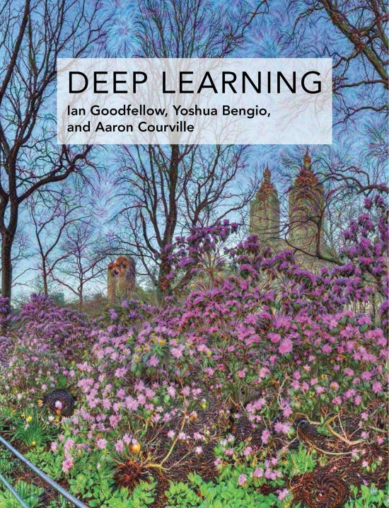

# Study notes for Machine Learning and Deep Learning with tensorflow

tensorflow를 기반으로 머신러닝, 딥러닝 스터디를 해보려고 합니다.

Pytorch가 아닌 Tensorflow를 선택한 이유는 [M1 gpu를 지원](apple.developer)해주기 때문입니다. 

제 개발 환경입니다:

## 참고 자료

- [M1 Mac terminal 셋업](https://danaing.github.io/etc/2022/03/28/M1-mac-iTerm2-setting.html)
  - 건너뛰셔도 되지만, 제가 첨부한 위 사진처럼 터미널을 fancy하게 셋팅하고 싶은 분들은 참고하시기 바랍니다.

- [M1 Mac conda miniforge, tensorflow 셋업](https://danaing.github.io/etc/2022/03/31/M1-mac-install-tensorflow.html)
  - IDE는 VS Code가 아닌 Rstudio를 이용할 예정입니다.
  - Rstudio가 제게 익숙하고, 추후 스터디 노트 또한 R마크다운으로 knitting해서 퍼블리쉬하려고 합니다.

## 딥러닝 스터디

### 핸즈온 

- Zhang, Aston, Zachary C. Lipton, Mu Li, and Alexander J. Smola. “Dive into Deep Learning.” ArXiv Preprint ArXiv:2106.11342, 2021. 
- [Source](https://d2l.ai/index.html)

### 이론 

- Goodfellow, Ian, Yoshua Bengio, and Aaron Courville. Deep Learning. MIT Press, 2016. 
- [Source](https://www.deeplearningbook.org)

## 머신러닝 스터디

### 핸즈온 

- Géron, Aurélien. Hands-on Machine Learning with Scikit-Learn and TensorFlow : Concepts, Tools, and Techniques to Build Intelligent Systems. Sebastopol, CA: O’Reilly Media, 2017.
- [Source code](https://github.com/ageron/handson-ml2)
- [Free pdf](https://github.com/ageron/handson-ml2)

### 이론 
- Hastie, Trevor, Robert Tibshirani, and Jerome Friedman. The Elements of Statistical Learning: Data Mining, Inference and Prediction. 2nd ed. Springer, 2009. http://www-stat.stanford.edu/~tibs/ElemStatLearn/.
- [Free pdf](https://hastie.su.domains/ElemStatLearn/)
