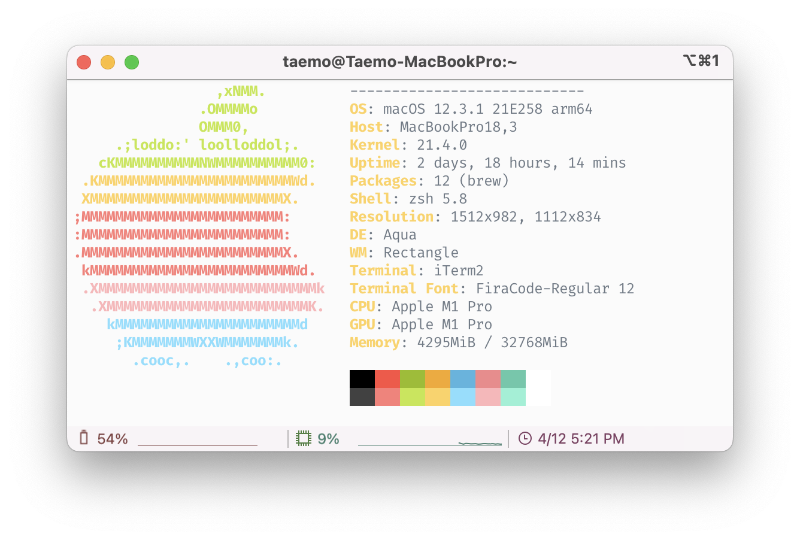
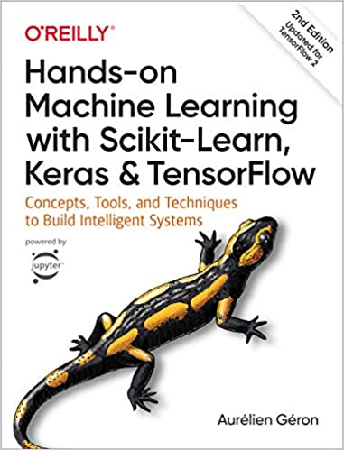

# Study notes for Tensorflow with M1 mac

tensorflow 스터디 노트입니다.😀

Pytorch가 아닌 Tensorflow를 선택한 이유는 [M1 gpu를 지원](apple.developer)해주기 때문입니다.

개발 환경입니다:

## 참고 자료

- [M1 Mac terminal 셋업](https://danaing.github.io/etc/2022/03/28/M1-mac-iTerm2-setting.html)
  - 건너뛰셔도 되지만, 제가 첨부한 위 사진처럼 터미널을 fancy하게 셋팅하고 싶은 분들은 참고하시기 바랍니다.

- [M1 Mac conda miniforge, tensorflow 셋업](https://danaing.github.io/etc/2022/03/31/M1-mac-install-tensorflow.html)
  - IDE는 VS Code가 아닌 Rstudio를 이용할 예정입니다.
  - Rstudio가 제게 익숙하고, 추후 스터디 노트 또한 R마크다운으로 knitting해서 퍼블리쉬하려고 합니다.

## Dive into Deep Learning 

- Source: https://d2l.ai/index.html
- Tensorflow를 이용한 딥러닝 스터디

 

## Hands-on Machine Learning 

- Source code: https://github.com/ageron/handson-ml2
- Scikit-Learn, Keras & Tensorflow를 이용한 머신러닝 스터디

